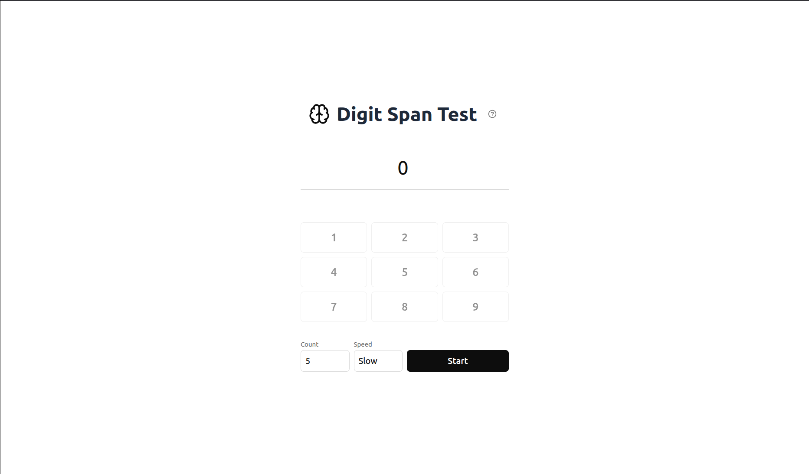

# Digit Span Test

A small digit span app for testing your working memory with neat UI (unlike other top websites that show up in search ...)

## What is it

The digit span memory test displays a short sequence of digits one at a time, then waits for you to enter the sequence from memory.

## Features

- [x] adjustable digit count from 3 to 12
- [x] slow and fast playback modes
- [ ] backward recall
- [ ] attempt history

## Stack

React, Vite, TypeScript, Tailwind CSS, ShadcnUI
